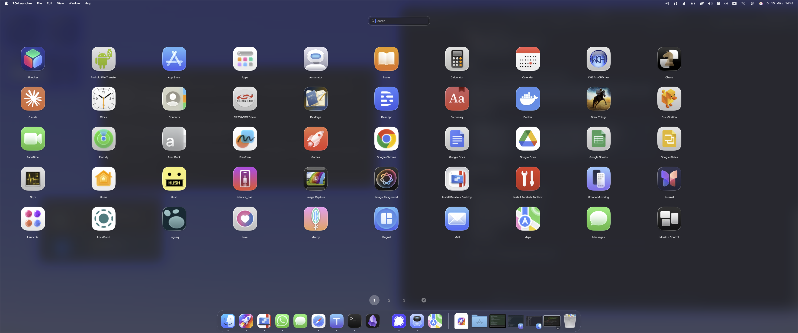
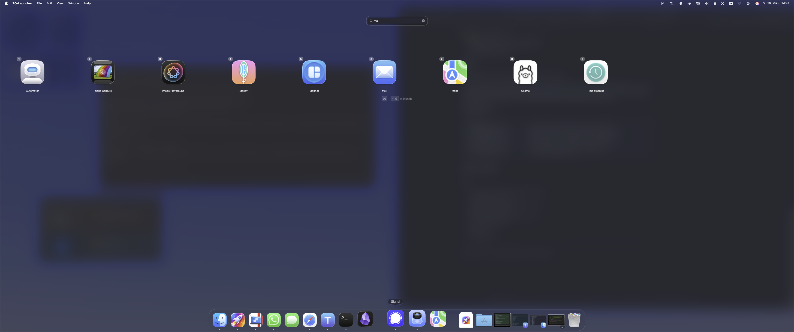

<p align="center">
  
</p>

<h1 align="center">ZO-Launcher</h1>
<p align="center"><strong>The Launchpad Apple removed — rebuilt properly.</strong></p>

<p align="center">
  
  
  
</p>

<p align="center">
  
</p>

## Why?

macOS 26 Tahoe removed the Launchpad entirely. The replacement (Spotlight-based "Apps" panel) is unreliable and doesn't show all installed apps. ZO-Launcher brings back a proper fullscreen grid launcher with search, keyboard shortcuts, and customizable layout.

## Features

### Grid View
- Fullscreen overlay showing all apps from `/Applications` and `/System/Applications`
- Paged grid with smooth swipe/scroll navigation
- Configurable columns (4-10), rows (3-8), and icon size
- Page selector with numbered buttons (1, 2, 3...)
- Arrow keys, drag, or scroll wheel to switch pages

### Search

<p align="center">
  
</p>

- Auto-focused search bar — just start typing
- Results displayed in same grid layout with numbered badges (1-9)
- **Enter** launches first result
- **Cmd+1-9** launches Nth result
- ESC clears search, second ESC hides launcher

### Global Hotkey
- **Ctrl+Space** toggles the launcher from anywhere
- App stays running in background, instant show/hide
- Auto-hides when clicking another app (focus loss)

### Settings (Cmd+,)
- Grid Columns slider (4-10)
- Grid Rows slider (3-8)
- Icon Size slider (Small/Medium/Large)
- Start at Login toggle

## Keyboard Shortcuts

| Shortcut | Action |
|----------|--------|
| `Ctrl+Space` | Show/hide launcher (global) |
| `Esc` | Clear search / hide launcher |
| `Enter` | Launch first search result |
| `Cmd+1-9` | Launch Nth search result |
| `Arrow Left/Right` | Switch pages |
| `Cmd+,` | Open settings |

## Tech Stack

- **SwiftUI** with AppKit integration (NSViewRepresentable)
- **Carbon Events API** for global hotkey registration
- **SMAppService** for Start at Login (macOS 13+)
- **@AppStorage** for persistent user settings
- No external dependencies

## Build

Requires Xcode and an Apple Developer certificate for signing.

```bash
xcodebuild -project ZO-Launcher.xcodeproj -scheme ZO-Launcher -configuration Release
codesign --deep --force --sign "Apple Development: your@email.com (TEAM_ID)" build/Release/ZO-Launcher.app
```

## Architecture

```
ZO-Launcher/
├── ZOLauncherApp.swift          # App entry, loads apps, chunks into pages
├── AppDelegate.swift            # Global hotkey (Ctrl+Space), hide/show/toggle
├── PagedGridView.swift          # Main UI: search, paged grid, event monitors
├── ContentView.swift            # Grid layout for single page, number badges
├── SettingsView.swift           # Settings UI with sliders + login toggle
├── WindowAccessor.swift         # Fullscreen frameless floating window
└── Assets.xcassets/             # Custom rocket app icon
```

## Version History

### v1.0
- Fullscreen grid launcher with paged navigation
- Live search with auto-focus
- Configurable grid (columns, rows, icon size)
- Global hotkey (Ctrl+Space)
- Cmd+1-9 quick launch from search results
- Auto-hide on focus loss
- Start at Login
- Custom app icon

---

*Built by Zerone — because Apple broke the Launchpad.*
